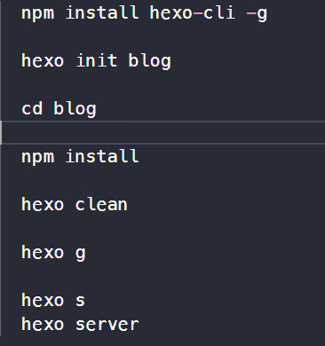

# Hexo

[TOC]


## Hexo序言
* 花了一个晚上，搭建了个 Github博客，先上链接
* 接下来就要安心写作，坚持总结


## Hexo是什么？
* 基于Node.js的静态博客框架
* 方便的生成静态网页托管在GitHub和Coding上，
* 是搭建博客的首选框架



## Hexo + Github 搭建博客的好处有：
1. 全是静态文件，访问速度快
2. 免费方便，不用花一分钱就可以搭建一个自由的个人博客，不需要服务器不需要后台
3. 可以绑定自己的域名，不仔细看的话根本看不出来你的网站是基于github的
4. 数据安全，基于github的版本管理，想恢复到哪个历史版本都行
5. 博客内容可以轻松打包、转移、发布到其它平台


## Hexo 文件目录
```
  node_modules: 依赖包

  public：存放生成的页面


  scaffolds：生成文章的一些模板

  source：用来存放你的文章

  themes：主题
    themes/next/_config.yml 主题配置

  _config.yml: 配置文件**

```


## HEXO CLI
```
front-matter

  hexo new "postName" #新建文章
  hexo new page "pageName" #新建页面
  hexo generate #生成静态页面至public目录
  hexo server #开启预览访问端口（默认端口4000，'ctrl + c'关闭server）
  hexo deploy #部署到GitHub
  hexo help  # 查看帮助
  hexo version  #查看Hexo的版本

缩写
  hexo n == hexo new
  hexo g == hexo generate
  hexo s == hexo server
  hexo d == hexo deploy

组合
  hexo s -g #生成并本地预览
  hexo d -g #生成并上传

```


## 部署到 Github上 & 绑定域名
1. 本机安装 Git, Node.js, Hexo

* hexo deploy,就是将public/ 文件夹中内容上传到git仓库
* 创建一个和你用户名相同的仓库，后面加.github.io，例如 ` lulongwen.github.io `


## Hexo 设置

### 1 `_config.yml ` 配置
```
  /_config.yml 站点配置文件

  themes/next/_config.yml 主题配置文件


设置中文
  /_config.yml
  language: zh-Hans // 这里设置语言 简体中文
  把 theme/next/languages/目录下 zh-CN.yml 改为 zh-Hans.yml

```


### 2 更换主题


### Hexo 代码压缩
```
// 1 安装 hexo-neat
  npm install hexo-neat -S

// 2 根目录 /_config.yml 添加以下代码


# hexo-neat
# 压缩注意事项：压缩 HTML 不要跳过 .md & .swig 模板引擎文件
neat_enable: true

neat_html:
  enable: true
  exclude:
  
neat_css:
  enable: true
  exclude:
    - '**/*.min.css'
    # - '*.min.css' # 给压缩的文件指定正确的路径

neat_js:
  enable: true
  mangle: true
  output:
  compress:
  exclude:
    - '**/*.min.js'
    - '**/jquery.fancybox.pack.js'
    - '**/index.js'
    # - '*.min.js'

```


### 3 搜索SEO
```
// 安装 sitemap 
// sitemap.xml Google & baidusitemap.xml
npm install hexo-generator-sitemap --save
npm install hexo-generator-baidu-sitemap --save

npm install hexo-generator-sitemap hexo-generator-baidu-sitemap -S

// nofollow 标签
npm install hexo-autonofollow -S

// 修改以下文件
\themes\next\layout\index.swig
\themes\next\layout\_partials\head\head.swig
\themes\next\layout_macro\post.swig
\themes\next\layout\_partials

```


### 4 阅读量统计


### 5 添加评论


## HEXO 错误
```
部署hexo时出现
  ERROR Deployer not found: Git

解决方法：
  npm install hexo-deployer-git -S

```


## `hexo new 'title'` & `hexo new page 'title'` 的区别
```
  page
    生成文件夹
    不会作为文章出现在博文目录

  new 直接生成 在 _post/ 下

```


