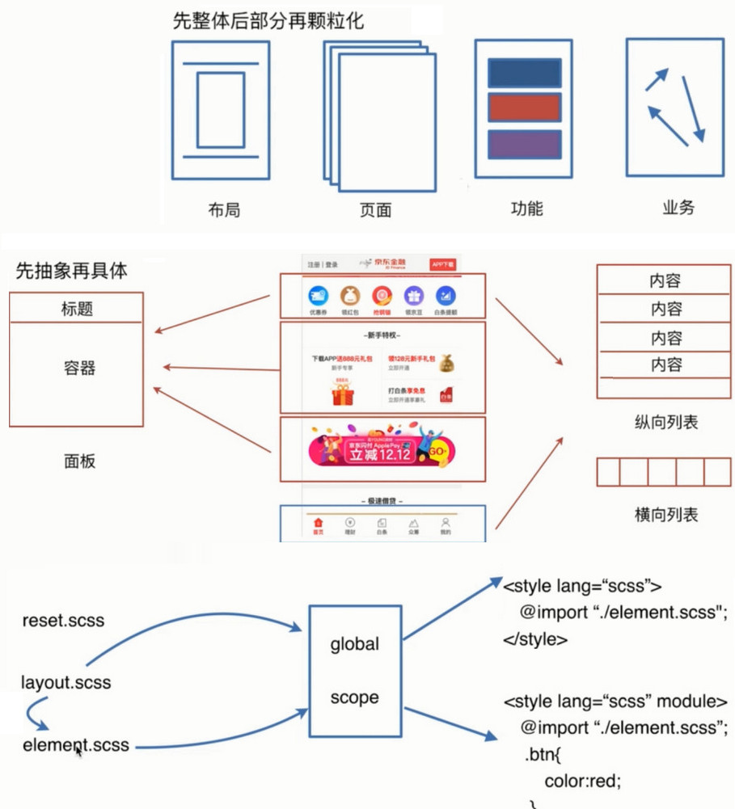
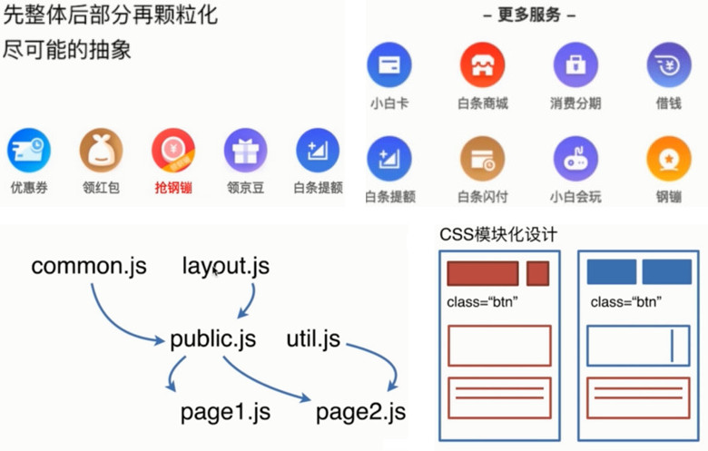
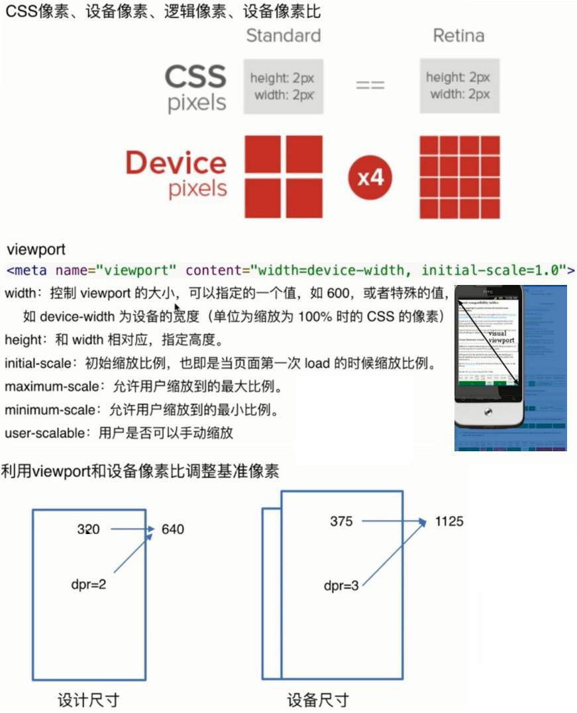
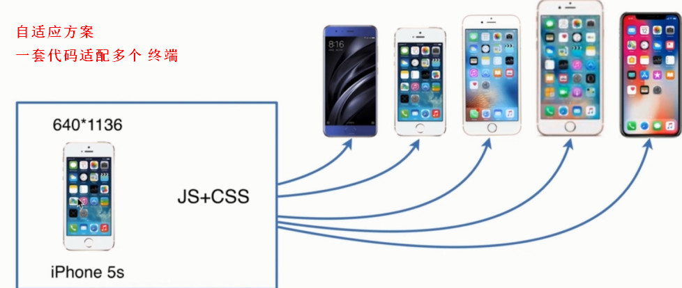
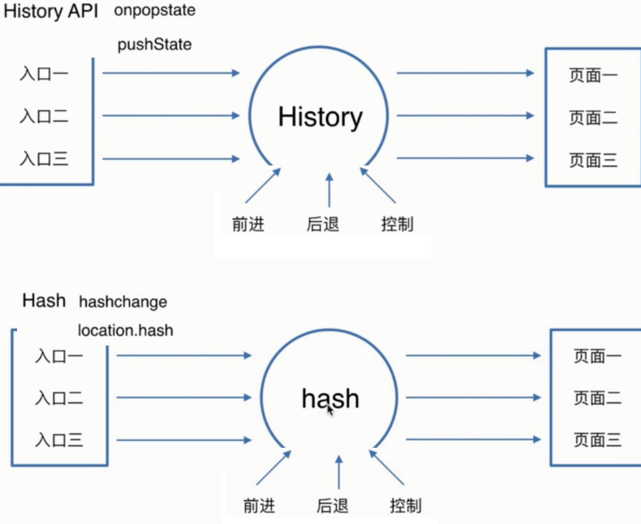

# 前端技术选型

> 项目自动化构建设计

1. CSS 模块化设计
2. JS 模块化设计
3. 多端自适应设计
4. SPA 设计
5. 前端构建工具
6. 上线部署

* [前端性能最佳实践](https://www.cnblogs.com/developersupport/p/webpage-performance-best-practices.html)


## 1 CSS 模块化

1. 设计原则
    * 可复用，能继承，要完整
    * 周期性迭代，所有的代码不可能一步到位
      * 好的代码是：模仿，设计，重构出来的
      * 周期性的迭代，控制代码质量，不能积累到一个量上，才去重构
      * 保证代码质量和产品质量
            
2. 设计方法
  * 先抽象，后具体
  * 先整体，后部分，再颗粒化
  * 
   


## 2 JS 模块化设计

1. 设计原则
  * 高内聚，低耦合
    * 组件功能受控于组件本身，而不是其他组件
    
  * 周期性迭代
  * 周期性的迭代，控制代码质量，不能积累到一个量上，才去重构

2. 设计方法
  * 尽可能的抽象
  * 先整体，后部分，再颗粒化
  * 


## 3 多端自适应设计

1. 响应式概念
  * [CSS像素，设备像素，逻辑像素，设备像素比](https://github.com/jawil/blog/issues/21)
  * viewport，ppi, rem
  * 

2. 工作原理
  * 利用 viewport 和设备像素比，调整基准像素
  * 利用 px2rem 自动转换 css单位
  * 
  


## 4 SPA 设计

1. SPA的好处
    * 前端端分离
    * 减轻服务器压力
    * 增强用户体验
    * Prerender 预渲染优化 SEO

2. SPA原理
    * history API
    * hash API
    * 


## 5 前端构建工具

* webpack
* gulp
* rollup
* prepack
* fis

### 为什么需要构建工具

* 资源压缩
* 静态资源转换
* 模块处理
* 编译处理

### 前端自动化构建工具

* npm init -> package.json
    * 创建 webpack.config.js
    
* webpack配置
    * entry
    * output
    * module
      * loader
    * plugins
    * webpack-dev-server
    * resolve
    * devtool
    
* npm scripts
* Gulp
* [Babel](https://www.babeljs.cn/docs/usage)
  * [babel & ES6](http://www.imooc.com/article/21866)

* eslint 保证代码质量规范
    
### 测试构建工具

* 是否能编译 Vue, Sass, Es6
* Eslint 代码风格检查
* 浏览器自动刷新


### 代码可复用性设计的思考

* 需求变更
* 产品迭代
* Bug 定位
* 新功能开发


## 6 上线部署

* 生产构建
  * 抽取：提取页面 style标签，合并为一个 link
  * 合并：压缩 css, js
  * 调试：开启 sourceMap

* 发布部署
  * 提交：使用 git 提交代码，版本管理
  * 部署：php，java 从 git 仓库拉取代码，通过小流量，跨机房，全量部署
  * 开启 gzip 压缩
  * 更新 cdn

* 独立构建一个项目，做到独挡一面
  * [将项目做出亮点，面试又该如何表现](interview.md)
  * 业务开发中提升技术实力
  * 不要把时间都给公司写业务代码上，这样没有成长；要提高效率，多学习

* 你想要把项目做到最优，就需要经常的迭代


## MVVM框架

* vue.js
* react.js


## 模块化设计

* css 模块化
* js 模块化


## 自适应方案

* 一份样式适配多个终端


## 代码可维护性，复用性及健壮性的思考

* 需求变更
* 产品迭代
* Bug 定位
* 新功能开发


### 2 运行环境

* Node
    * Nvm：node版本管理
* Nrm：npm镜像源管理
* [Git 快速上手](https://www.bootcss.com/p/git-guide/)
* Chrome


### 3 编辑器

* Webstorm
* Vscode
* Eslint


### 4 基础知识

* Html5
* Css3
* ES6
* [Sass](https://sass.bootcss.com/documentation)
* Vue.js


## 工欲善其事必先利其器 & 工具安装

```
chrome

webstorm

node node -v

git  git --version

github 注册账号

vue cli

```


## Git & GitLab & Github


## Webpack


## BI 数据可视化
* 原型图
* 思维导图
* 流程图
* 泳道图
* ER图


## 组件库工程化实践
* 组件管理方案
* 组件需求
	- 多组件
	- 多人参与，社区参与
	- 秘密性


## 可视化配置
* 组件的配置自动化
* 文档自动生成
* 主题配置工具


## 多包管理工具 [lerna](https://lernajs.io)
* 一键安装依赖
* 自动更新依赖
* 独立版本管理
* 非 npm 包


## 文档方案 [docsify](https://docsify.js.org/#/zh-cn/quickstart)
* 多语言
* 全文检索
* git pages
* 插件扩展


## 翻译方案 [crowdin.com](https://crowdin.com)
* 逐句翻译
* 翻译推荐
* 进度管理
* 审核机制


## ## [i18n]()
* i18n
* 45 种语言支持


## 测试
* 白盒测试，用代码测试代码
* 黑盒测试，走流程，点击页面按钮


## 学习进阶
* [技术点资源](https://www.jianshu.com/p/063a620ef466)
* [2018学习路线](https://github.com/kamranahmedse/developer-roadmap)
	1. 前端开发
	2. 后端开发
	3. 架构师
	4. DevOps 软件工程
		* Development Operations
		* Dev 软件开发人员 Development / Software Engineering
		* Ops IT运维技术人员 Technology Operations
		* 为了按时交付软件产品和服务，开发和运营工作必须紧密合作

	5. QA 技术运营和质量保障
		* Quality Assurance


## 其他技术
```jsx
	工作流引擎 Activiti7

	Apache Shiro
		一个强大且易用的Java安全框架,执行身份验证、授权、密码和会话管理。
		使用Shiro的易于理解的API,您可以快速、轻松地获得任何应用程序,
		从最小的移动应用程序到最大的网络和企业应用程序。

```


## 项目命名规范

```jsx
  api 接口

  layouts 布局

  views 视图

  store 数据仓库

  service 是处理单一业务的

  utils 通用业务无关, 可供其他程序使用

  tools 部分业务相关的

  helper 帮助类，一些功能辅助
```


## IT项目经理
* [网易IT项目经理视频](https://mooc.study.163.com/smartSpec/detail/55001.htm)
* 跨终端开发
  * Vue技术栈选 uni-app
  * React技术栈选 taro
  * 选择自己熟悉的技术栈，相对而言， uni-app的多端成熟度更好
  * [移动端框架测评](https://juejin.im/post/5cfdcf056fb9a07ecd3d5068#heading-13)
