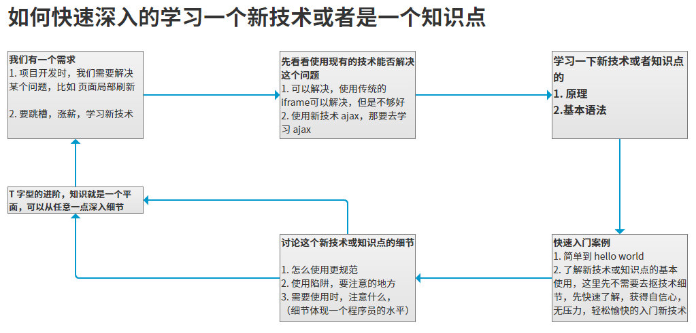

# 如何快速的学习一门新技术
* 高效而愉快的学习
* 先建立一个整体框架，然后细节
* 在实际工作中，要培养用到什么，能够快速学习的能力
* 先实现 know how, 再细节 know why
* 软件编程是一门 “做中学”的学科，不是回了在做，而是做了才会
* 学习软件编程实在琢磨别人怎么做，而不是我认为应该怎么做的过程
* 适当的囫囵吞枣
* 编程是边做边学习的学科，光听不练不是学不到东西的
* 边做边学，是做了才会，不是会了才做

## 学习方法
* 每天学习 2 -3 个小时
* 坚持5个月
  * 自己有坚持下去的决心和毅力，能够保证一直坚持学习下去
  * 人人都有焦虑症状，最重要的是要坚持并踏实的走下去
  * 提高学习的加速度，而不是学习的速度
* 坚持是一种态度，也是一种能力

## 学习一门编程语言的目的？
  这门技术的应用领域
     PHP web
     Python 大数据

  学习技术时要注意的问题，如何去学习这门语言
  和其他编程语言的相同点
  回答别人一个技术点的技巧？
    1 这个技术是什么？
    2 用的时候要注意什么？

## 技术的快速入门
  学习技术，要么好好学，要么就不学。
    踏踏实实的学，不要玩，要把知识学到位
    不一定要你把原理搞得很明白，但是你要能够做出来。

  快速入门，不要去抠细节
    先有了基本的认识，再去研究细节，才不会觉得繁琐。
    前期不要太抠细节，先要有整体框架；熟练了，要能深入到技术细节。
    细节，特别耗费时间。

  学习编程是在琢磨：别人怎么做！而不是我认为该怎么做？
    不是你认为，不是你的想法，而是你要去琢磨设计者设计这门语言的思维。
    应该把重点放在 逻辑的处理上，而不是语法本身上。
    重点是学习编程思想和逻辑思维。

  举例就用生活化的例子，生活化的东西，大家都很容易理解。

